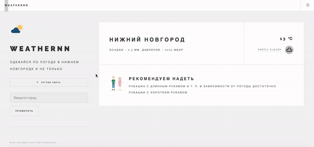

# WeatherNN


Тестовое задание для Школы Будущих СТО by Yandex

  - Умный сервис прогноза погоды
  - Сложность: задача со звездочкой

# Проектирование сервиса

  - Backend - Python (Microframework Flask); JS for working with GeoAPI
  - Frontend - JavaScript (Vanilla js and jQuery), CSS, HTML
  - UserInterface - Progressive WebApp
  - API - weatherstackAPI
  - Формат ответа: данные о температуре, влажности, давлении, погодных условиях и др. c API - текстовый шаблон. Изображение описывающее погоду с API - ссылка на изображение. Рекомендации о предпочтительной одежде после обсчета данных с API - картинка и текст. Автозаполнение в поле ввода - текст.
 
# Демо работы сервиса

Ссылка на видео: https://yadi.sk/i/YkZDGZX6eenRlw


# Процесс работы программы по шагам

Сервис - веб-приложение, которое отбражает погоду в Нижнем Новгороде и рекомендацию о повседневной одежде.
  - На главной странице сразу же отображаются данные о текущей погоде в НН, а также рекомендация о том, как лучше одеться (формируется на основе данных о температуре и погодных условиях)
  - При нажатии на кнопку "Погода здесь", пользователю при первом запуске поступит запрос на разрешение данных о местоположении - если пользователь подтверждает запрос, отобразится погода там, где он сейчас находится. В противном случае внизу появится предупреждение о том, что "GeoPositionAPI отключен".
  - При вводе города в поле на главной странице для российских городов и регионов работает автозаполнение, но так же можно проверить погоду и зарубежом. Если пользователь введет несуществующее название города, появится страница ошибки и попросит внести данные снова.

# Запуск

Требования - Python 3, git

- Склонировать репозиторий и перейти в папку в терминале
```sh
$ git clone https://github.com/noreederek/weathernn.git
$ cd weathernn
```
- Установить виртуальное окружение (python или python3, в зависимости от настроек)
```sh
$ python3 -m venv venv
$ source venv/bin/activate
(Windows: venv\bin\activate.bat)
```
- Установить зависимости и пакеты. Запустить приложение
```sh
$ (venv) pip install -r requirements.txt
$ (venv) python3 app.py
```
- Открыть localhost:8080 (в браузере Chrome (и других на движке Chromium) без https может не работать определение расположения из-за ограничений безопасности; пробуйте Firefox)

# Что можно улучшить?

  - Отображать больше информации с API (погода на неделю, история и др - но в большинстве API платная подписка для такого функционала)
  - Более персонифицированные рекомендации одежды (учитывать регион, добавить больше переменных для рекомендации)

License
----
MIT

**By Mayorov Yuri for "Yandex Школа Будущих СТО (Chief Technical Officer)"**

`Desktop`


`Mobile`


